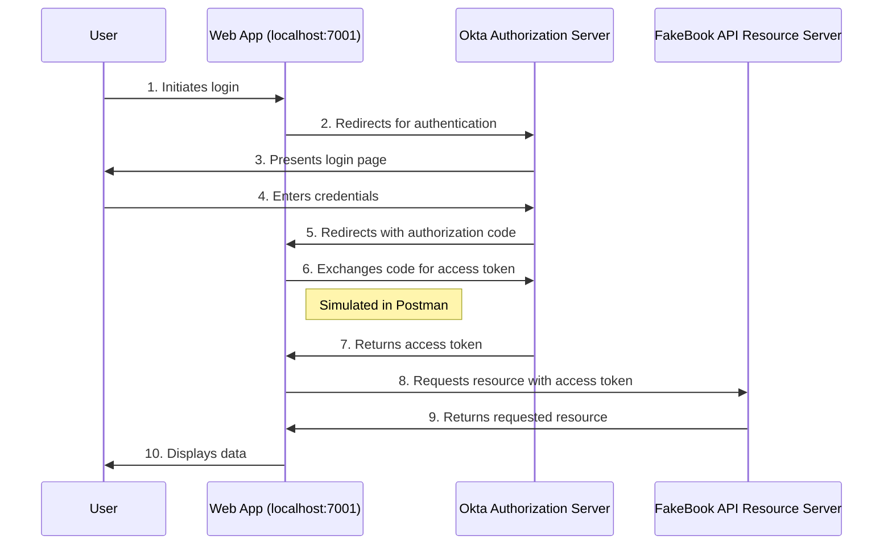

# OAuth 2.0 Authentication Demonstration

This project demonstrates the implementation of two key OAuth 2.0 authentication flows using Okta as the authorization server and a Flask-based API as the resource server. The FakeBook API showcases how to secure and access protected resources using different OAuth 2.0 grant types, catering to various use cases in modern application architectures.

The project covers two main authentication scenarios:

1. **Machine-to-Machine Authentication with Client Credentials Grant**
   - Demonstrates how to authenticate and authorize requests between services or applications without user involvement.
   - Ideal for backend services, cron jobs, or any scenario where a human user is not directly involved.
   - Shows how to obtain and use access tokens for machine-to-machine communication.

2. **User Authentication Flow with Authorization Code Grant**
   - Illustrates the process of authenticating users and obtaining their authorization to access protected resources.
   - Suitable for web applications where user interaction is required.
   - Demonstrates the complete flow from user login to accessing protected API endpoints on behalf of the user.

Key Features:
- Integration with Okta for robust identity and access management.
- Implementation of a Flask-based API serving as the resource server.
- Detailed step-by-step guide for setting up and testing both authentication flows.
- Explanation of OAuth 2.0 concepts, including token handling, scope usage, and security considerations.


# Machine-to-Machine Authentication with Client Credentials Grant

This section demonstrates the OAuth 2.0 Client Credentials flow, which is used for machine-to-machine authentication without user involvement.


The above diagram illustrates the OAuth 2.0 Client Credentials flow implemented in this project:

1. A client application (simulated by Postman acting as a Cron Job) requests an access token from the Okta Authorization Server using the Client Credentials grant type.
2. Okta's Authorization Server validates the client credentials and issues an access token.
3. The client then calls the FakeBook API with the obtained access token.
4. The FakeBook API validates the token by retrieving the public signing keys from Okta's JSON Web Key Set (JWKS) endpoint.
5. If the token is valid and has the required scopes, the API processes the request and returns the response.

This setup demonstrates a real-world scenario where a backend service or cron job needs to access an API securely without user interaction. The FakeBook API provides endpoints for managing a collection of books, with different access levels based on OAuth scopes:
- Reading book information requires the 'fakebookapi.read' scope
- Adding new books requires the 'fakebookapi.admin' scope

By implementing this flow, we ensure that only authenticated and authorized clients can access our API, with fine-grained control over permissions using OAuth scopes.

## Project Overview

This project demonstrates the implementation of OAuth 2.0 Client Credentials flow using Okta as the authorization server. The setup involves three main components:

1. **FakeBook API Server**: A Flask-based API that manages book information and requires OAuth 2.0 token authentication.

2. **Okta Client Application**: An application registered in Okta that represents the client seeking access to the FakeBook API.

3. **Postman (Emulating a Cron Job)**: Used to simulate a backend service or scheduled job that interacts with the FakeBook API using OAuth 2.0 tokens.

Below, we'll go through the setup and usage of each of these components in detail.

## Okta Developer Account Setup

To use this API with Okta as the authorization server, you need to set up an Okta developer account and create an application. Follow these steps:

1. Sign up for an Okta Developer Account:
   - Go to [https://developer.okta.com/](https://developer.okta.com/)
   - Click on "Sign Up" and complete the registration process

2. Create a new Application:
   - Log in to your Okta developer dashboard
   - Navigate to Applications > Create App Integration
   - Select "API Services" as the type of application
   - Click "Next"

3. Configure the Application:
   - Name: Enter "FakeBook Cron" (or any name you prefer)
   - Grant type: Ensure "Client Credentials" is selected
   - Click "Save"

4. Assign API Scopes:
   - In your new application's settings, go to the "Scopes" tab
   - Add the following scopes:
     - `fakebookapi.read`
     - `fakebookapi.admin`
   - If these scopes don't exist, you may need to create them in your Authorization Server settings

5. Copy Credentials:
   - In the "General" tab of your application, you will find the "Client ID"
   - Click on "Show" next to "Client secret" to reveal the secret
   - Copy both the Client ID and Client secret; you'll need these for authentication in Postman

6. Configure Your Authorization Server:
   - Go to Security > API > Authorization Servers
   - Select your authorization server (or create a new one if needed)
   - In the "Scopes" tab, add the `fakebookapi.read` and `fakebookapi.admin` scopes if they don't already exist

7. Update Your Application:
   - https://dev-45134456.okta.com/oauth2/default/.well-known/openid-configuration
   - Open the `app.py` file in your project
   - It will look similar to below. Replace the `OKTA_JWKS_URI` with your Okta domain's JWKS URI:
     ```python
     OKTA_JWKS_URI = 'https://{yourOktaDomain}/oauth2/default/v1/keys'
     ```
   - Replace `{yourOktaDomain}` with your actual Okta domain (e.g., `dev-1234567.okta.com`)

Now you're ready to use these credentials in Postman to obtain access tokens from Okta and test your FakeBook API.

## FakeBook API

### Introduction

FakeBook API is a Flask-based RESTful API that demonstrates OAuth 2.0 integration with Okta for authentication and authorization. This project showcases how to implement secure, scope-based access control for API endpoints using JSON Web Tokens (JWTs) issued by Okta.

The API provides endpoints for managing a collection of books, with different access levels based on OAuth scopes:
- Reading book information requires the 'fakebookapi.read' scope
- Adding new books requires the 'fakebookapi.admin' scope

This setup mimics real-world scenarios where different API operations require different levels of access.


## Setup and Installation

### Prerequisites

- Python 3.7 or higher
- pip (Python package installer)
- An Okta developer account

### Setting Up the Virtual Environment

1. Clone the repository:
   ```
   git clone https://github.com/your-username/fakebook-api.git
   cd fakebook-api
   ```

2. Create a virtual environment:
   ```
   python3 -m venv venv
   ```

3. Activate the virtual environment:
   - On macOS and Linux:
     ```
     source venv/bin/activate
     ```
   - On Windows:
     ```
     venv\Scripts\activate
     ```

4. Install the required packages:
   ```
   pip install flask flask-restful pyjwt[crypto] cryptography
   ```

### Configuration

1. Open `app.py` and replace the `OKTA_JWKS_URI` with your Okta domain's JWKS URI:
   ```python
   OKTA_JWKS_URI = 'https://your-okta-domain.okta.com/oauth2/default/v1/keys'
   ```
   JWKS endpoint URI can also be obtained through the below URL (double check this to make sure you are using the correct URI):
   - https://dev-45134456.okta.com/oauth2/default/.well-known/openid-configuration
   - Replace `dev-45134456.okta.com` with your actual Okta domain (e.g., `dev-1234567.okta.com`)
     
2. Ensure your Okta application is set up with the correct scopes ('fakebookapi.read' and 'fakebookapi.admin'). 

## Running the Application

1. Ensure your virtual environment is activated.

2. Run the Flask application:
   ```
   python app.py
   ```

3. The server will start, typically on `http://127.0.0.1:5000/`.

## Code Explanation

### Main Components

1. **Flask and Flask-RESTful Setup** (Lines 1-5, 10-13):
   The application uses Flask as the web framework and Flask-RESTful for creating RESTful APIs.
   ```python
   from flask import Flask, jsonify, request
   from flask_restful import Api, Resource
   # ...
   app = Flask(__name__)
   api = Api(app)
   ```

2. **JWT Verification** (Lines 6-7, 14-16):
   Custom JWT verification is implemented using PyJWKClient, which fetches the signing key from Okta's JWKS endpoint.
   ```python
   from jwt import PyJWKClient, decode as jwt_decode, exceptions as jwt_exceptions
   # ...
   OKTA_JWKS_URI = 'https://dev-45134456.okta.com/oauth2/default/v1/keys'
   jwks_client = PyJWKClient(OKTA_JWKS_URI)
   ```

3. **Scope-based Access Control** (Lines 40-54):
   The `require_scope` decorator checks for required scopes in the JWT claims.
   ```python
   def require_scope(required_scope):
       def decorator(fn):
           @wraps(fn)
           def wrapper(*args, **kwargs):
               # ... (scope checking logic)
           return wrapper
       return decorator
   ```

4. **Book Model and Data** (Lines 17-36):
   A simple `FakeBook` class represents book objects, with a list of books stored in memory.
   ```python
   class FakeBook:
       def __init__(self, id, title, author, cost, num_pages):
           # ... (FakeBook initialization)
   
   books = [
       FakeBook(1, "And Then There Were None", "Agatha Christie", 7.99, 300),
       # ... (more books)
   ]
   ```

5. **API Resources** (Lines 55-80):
   * `BookList`: Handles GET (list all books) and POST (add a new book) requests.
   * `Book`: Handles GET requests for individual books.
   ```python
   class BookList(Resource):
       @require_scope('fakebookapi.read')
       def get(self):
           # ... (GET logic)
   
       @require_scope('fakebookapi.admin')
       def post(self):
           # ... (POST logic)
   
   class Book(Resource):
       @require_scope('fakebookapi.read')
       def get(self, book_id):
           # ... (GET single book logic)
   ```

### Key Functions

1. **verify_jwt(token)** (Lines 25-35):
   Verifies the JWT using Okta's JWKS. It handles token expiration and invalidity.
   ```python
   def verify_jwt(token):
       try:
           signing_key = jwks_client.get_signing_key_from_jwt(token)
           decoded_token = jwt_decode(token, signing_key.key, algorithms=["RS256"], audience='api://default')
           return decoded_token
       except jwt_exceptions.ExpiredSignatureError:
           return {"message": "Token has expired"}, 401
       except jwt_exceptions.InvalidTokenError:
           return {"message": "Invalid token"}, 401
   ```

2. **require_scope(required_scope)** (Lines 40-54):
   A decorator that checks if the JWT contains the required scope for the operation.
   ```python
   def require_scope(required_scope):
       def decorator(fn):
           @wraps(fn)
           def wrapper(*args, **kwargs):
               # ... (scope checking logic)
           return wrapper
       return decorator
   ```

3. **before_request()** (Lines 85-87):
   Ensures the application remains stateless by disabling session creation.
   ```python
   @app.before_request
   def before_request():
       request.environ['werkzeug.session_interface'] = None
   ```


## Testing With Postman

You can test the API using tools like Postman or curl. This guide will walk you through the process of obtaining a JWT token from Okta and using it to interact with the FakeBook API.

### Prerequisites
- Postman or curl installed
- Your Okta developer account credentials

### Step 1 & 2: Obtain JWT Token from Okta

#### 1. Construct a Token Request for Client Credentials

**Endpoint:** `https://dev-45134456.okta.com/oauth2/default/v1/token`
**HTTP Method:** POST
**Headers:**
- Content-Type: application/x-www-form-urlencoded

**Body:**
```
grant_type=client_credentials
client_id=<your_client_id>
client_secret=<your_client_secret>
scope=fakebookapi.read
```

#### 2. Send Token Request and Extract Token

- Send the request to Okta's token endpoint
- Okta will return a JWT access token
- You can decode and inspect the token at [jwt.io](https://jwt.io)

**Note:** 
- Using `openid` as the scope will fail (Why? OpenID Connect scopes are not applicable for Client Credentials flow)
- No ID token or refresh token is provided in this flow


### Step 3 & 4: Use the Token with FakeBook API

#### 3. Prepare API Request

**Endpoint:** `http://localhost:5000/books/1`
**HTTP Method:** GET
**Headers:**
```
Authorization: Bearer <your_jwt_token>
```

#### 4. Send Request to FakeBook API

Send the request and observe the response. You should receive details of the book with ID 1.


### Step 5: Attempt to Create a Book (Expected to Fail)

**Endpoint:** `http://localhost:5000/books`
**HTTP Method:** POST
**Headers:**
```
Authorization: Bearer <your_jwt_token>
Content-Type: application/json
```
**Body:** (Example)
```json
{
        "author": "Woziek Schezcny",
        "cost": 7.99,
        "id": 6,
        "num_pages": 300,
        "title": "And Then There Were None"
    }
```

This request will fail because the access token only has the `fakebookapi.read` scope.

### Obtaining a Token with Admin Scope

To create books, you need a token with both `fakebookapi.read` and `fakebookapi.admin` scopes:

**Endpoint:** `https://dev-45134456.okta.com/oauth2/default/v1/token`
**HTTP Method:** POST
**Body:**
```
grant_type=client_credentials
client_id=<your_client_id>
client_secret=<your_client_secret>
scope=fakebookapi.read fakebookapi.admin
```

Use this new token to successfully create books via the POST /books endpoint.

### Summary of Scope Requirements

- To read books (GET /books or GET /books/<id>), the JWT token must have the 'fakebookapi.read' scope.
- To create a new book (POST /books), the JWT token must have the 'fakebookapi.admin' scope.
- If a token doesn't have the required scope, the request will be denied with a 403 error.

### Note on OpenID Connect Scopes:
If you attempt to use 'openid' as a scope in the client credentials grant, the request will fail. Here's why:

- The 'openid' scope is specific to OpenID Connect (OIDC), which is an identity layer on top of OAuth 2.0.
- The client credentials grant is designed for machine-to-machine communication where there's no user involved.
- OIDC scopes like 'openid', 'profile', or 'email' are meant for obtaining information about a user.
- In a client credentials flow, there's no user context, so these OIDC scopes are not applicable.

If you include 'openid' in your scope request for a client credentials grant, you'll typically receive an error response from the authorization server indicating that the scope is not valid for this grant type.

# User Authentication Flow with Authorization Code Grant

This section demonstrates the OAuth 2.0 Authorization Code flow, which is used for user authentication in web applications.

## Flow Diagram



## Flow Description

1. The user initiates the login process on the web application running on `http://localhost:7001`.
2. The web app redirects the user to Okta for authentication.
3. Okta presents a login page to the user.
4. The user enters their credentials on the Okta login page.
5. Upon successful authentication, Okta redirects back to the web app with an authorization code.
6. The web app exchanges this authorization code for an access token (This step is simulated using Postman in our setup).
7. Okta returns an access token to the web app.
8. The web app uses this access token to request resources from the FakeBook API resource server.
9. The FakeBook API validates the token and returns the requested resources.
10. The web app displays the retrieved data to the user.

This flow ensures secure user authentication and authorization before allowing access to protected resources in the FakeBook API.

## Okta Setup

1. Log in to your Okta Developer Console.

2. Navigate to "Applications" > "Create App Integration".

3. Select "OIDC - OpenID Connect" as the sign-on method and "Web Application" as the application type.

4. Click "Next".

5. Configure the app integration:
   - App integration name: FakebookAuthCodeClient
   - Grant types: Check "Authorization Code" and "Refresh Token"
   - Sign-in redirect URIs: http://localhost:7001
   - Sign-out redirect URIs: http://localhost:7001
   - Controlled access: Allow everyone in your organization to access

6. Click "Save" to create the application.

7. Note down the following credentials (you'll need these for the next steps):
   - Client ID
   - Client Secret

8. Under the "Assignments" tab, ensure that the appropriate users or groups are assigned to the application.

## Authorization Code Flow Steps

After setting up your Okta application, follow these steps to complete the Authorization Code flow:

### STEP 1: Construct an Authorization URL

Construct a URL to send to the Okta Authorization Server:

- Identify your authorize endpoint in your Okta application settings
- Use the following scopes: "openid profile email fakebookapi.read offline_access"

```
=============================================================================
STEP 1 : Construct a Authorization URL to send to Okta Authorization Server
============================================================================

ENDPOINT   => https://dev-45134456.okta.com/oauth2/default/v1/authorize
HTTP TYPE  => POST

response_type=code
redirect_uri=http://localhost:7001
client_id=example
scope= openid profile email fakebookapi.read offline_access
```

URL Format:
```
https://{YOUR_OKTA_DOMAIN}/oauth2/default/v1/authorize?response_type=code&client_id={YOUR_CLIENT_ID}&state=state123&redirect_uri={YOUR_REDIRECT_URI}&scope={SCOPES}&nonce=test123
```

Example URL:
```
https://dev-12345678.okta.com/oauth2/default/v1/authorize?response_type=code&client_id=0oa1bcde2fGhIJklm3n4&state=state123&redirect_uri=http%3A%2F%2Flocalhost%3A7001&scope=openid%20profile%20email%20fakebookapi.read%20offline_access&nonce=test123
```

In this example:
- `{YOUR_OKTA_DOMAIN}` is replaced with `dev-12345678.okta.com`
- `{YOUR_CLIENT_ID}` is replaced with `0oa1bcde2fGhIJklm3n4`
- `{YOUR_REDIRECT_URI}` is replaced with `http://localhost:7001` (URL-encoded)
- `{SCOPES}` is replaced with `openid profile email fakebookapi.read offline_access` (URL-encoded)

Note: 
- The redirect URI and scopes are URL-encoded in the actual URL. Spaces are replaced with `%20`, and other special characters are similarly encoded.
- Make sure to replace the domain, client ID, and redirect URI with your actual Okta application details.
- The `state` and `nonce` values (`state123` and `test123`) are used for demonstration. In a real application, these should be unique, randomly generated values for each request.

#### Understanding `state` and `nonce` parameters:

1. `state`:
   - The `state` parameter is used to maintain the state of the application during the authorization process.
   - It helps prevent cross-site request forgery (CSRF) attacks.
   - When you receive the response from Okta, you should verify that the `state` value matches the one you sent.
   - In a real application, you would typically use a randomly generated, unique value for each request.

2. `nonce`:
   - The `nonce` (number used once) is a random value used to associate a client session with an ID token and to mitigate replay attacks.
   - When you receive the ID token, you should verify that the `nonce` claim in the token matches the one you sent in the request.
   - Like `state`, in a production environment, you would generate a unique `nonce` for each authorization request.

For this demonstration, we're using static values (`state123` and `test123`), but in a real-world scenario, these should be dynamically generated, unique values for each authorization request.

#### Client Secret in OAuth 2.0 Authorization Code Flow

1. **Obtaining the Authorization Code:**
   - The client secret is NOT required when requesting the authorization code.
   - This step involves user authentication and authorization.
   - The client ID is used to identify the application to Okta, but the user credentials (not the client secret) are used for authentication.

2. **Exchanging the Authorization Code for Tokens:**
   - The client secret IS required when exchanging the authorization code for tokens.
   - This step happens server-side and does not involve user authentication.
   - The client secret proves the identity of the application to Okta.

Key Points:
- The authorization process (getting the code) requires user login but not the client secret.
- The token exchange process (getting the tokens) requires the client secret but not user authentication.

Why this design?
- User Authentication: The initial step ensures that the user grants permission to the application.
- Application Authentication: The second step ensures that only the legitimate application can exchange the code for tokens.

In practice:
- When a user clicks "Login with Okta," they're redirected to Okta to authenticate (first step).
- After user approval, your application servers use the client secret to securely obtain tokens (second step).

This two-step process enhances security by separating user authentication from application authentication, ensuring that sensitive credentials (like the client secret) are never exposed to the frontend or the user.

### STEP 2: Run a Local Web Server

Start a local web server to capture the Authorization Code:

```
python -m http.server 7001
```

Note: This step is optional if you've already set up a web server in previous steps.

### STEP 3: Send an Authorization Request

1. Open the constructed URL (from Step 4) in your web browser.
2. Log in using your Okta credentials.
3. After successful authentication, you'll be redirected to your redirect URI.
4. Capture the Authorization Code from:
   - The web server output console, or
   - The browser's address bar in the redirect URL
  
#### Okta Authorization and Redirection Process

1. **Initial Request**: The user's browser sends the authorization request to Okta.

2. **Okta Authentication**: Okta authenticates the user (if not already authenticated) and processes the authorization request.

3. **Okta Response**: After successful authentication and authorization, Okta sends a response back to the user's browser. This response is typically an HTTP 302 (Found) redirect.

4. **Browser Redirection**: The user's browser receives this redirect response and automatically follows it, sending a new request to the specified redirect URI.

5. **Redirect to Application**: This new request to the redirect URI includes the authorization code as a query parameter.

So, the process is:

```
User's Browser -> Okta -> User's Browser -> Redirect URI
```

Not:

```
User's Browser -> Okta -> Redirect URI
```

This method ensures that:
- The authorization code is never directly exposed to the client application server.
- The code is transmitted through the user's browser, which is considered a secure front-channel in OAuth 2.0.
- The client application can validate that the request is coming from the same user who initiated the authentication process.

This flow is a crucial security feature of the OAuth 2.0 Authorization Code grant, as it prevents certain types of attacks and ensures that the authorization code is only delivered to the intended recipient through the user's authenticated session.

### STEP 4: Exchange the Authorization Code for Tokens

Construct a token request to exchange the Authorization Code for an access token:

- Use the token endpoint from your Okta application settings
- Use the grant type "authorization_code"
- Include the Authorization Code obtained in Step 6


We'll use Postman to make this request in the next section.

---

These steps demonstrate the core flow of the Authorization Code grant. In a production environment, these steps would typically be handled automatically by your web application.

### STEP 5: Call the FakeBook API to Retrieve Books

After obtaining the access token in the previous step, you can now use it to make authenticated requests to the FakeBook API.

1. **Prepare the API Request**

   Endpoint: `http://localhost:5000/books`
   Method: GET
   Headers:
   - `Authorization: Bearer <your_access_token>`

2. **Make the API Call**

   You can use tools like Postman, curl, or any HTTP client library in your preferred programming language.

   Example using curl:
   ```bash
   curl -X GET 'http://localhost:5000/books' \
   -H 'Authorization: Bearer <your_access_token>'
   ```

   Replace `<your_access_token>` with the actual access token you received from Okta.

3. **Expected Response**

   If your request is successful, you should receive a JSON response containing a list of books. For example:

   ```json
   [
     {
       "id": 1,
       "title": "And Then There Were None",
       "author": "Agatha Christie",
       "cost": 7.99,
       "num_pages": 300
     },
     {
       "id": 2,
       "title": "A Study in Scarlet",
       "author": "Arthur Conan Doyle",
       "cost": 7.99,
       "num_pages": 108
     },
     // ... more books ...
   ]
   ```

   


4. **Troubleshooting**

   - If you receive a 401 Unauthorized error, check that your access token is valid and hasn't expired.
   - If you receive a 403 Forbidden error, ensure that your token includes the necessary scope (e.g., 'fakebookapi.read').

5. **Token Expiration**

   Access tokens have a limited lifespan. If your token expires, you'll need to obtain a new one using the refresh token (if available) or by repeating the authorization process.

Remember to keep your access token secure and never expose it in client-side code or public repositories.

This step demonstrates the successful use of the OAuth 2.0 flow to access protected resources in your FakeBook API. By using the access token obtained through the Authorization Code flow, you've securely authenticated and authorized the request to retrieve book data.

#### Why the API Trusts This Request

The FakeBook API trusts this request for several important reasons:

1. **Valid Access Token**: The request includes a valid access token issued by Okta, a trusted authorization server.

2. **Token Verification**: The API verifies the token's signature using Okta's public key (available at the JWKS endpoint). This ensures the token hasn't been tampered with.

3. **Scope Validation**: The API checks that the token includes the necessary scope (e.g., 'fakebookapi.read') for the requested operation.

4. **Token Claims**: The token contains claims (like issuer, audience, expiration time) that the API validates to ensure the token is intended for this specific API and is still valid.

5. **Secure Transmission**: The access token is sent over HTTPS, preventing interception or manipulation in transit.

By trusting Okta to handle authentication and using the access token to convey authorization, the API can focus on providing resources to authenticated and authorized clients without managing user credentials directly. This separation of concerns enhances security and simplifies the API's authentication logic.

Remember, the security of this system relies on protecting the access token. Always transmit it securely and never expose it in client-side code or public repositories.

### STEP 9: Demonstrate Scope Limitations and Resolution

In this step, we'll attempt to add a book to the FakeBook API using the access token obtained in previous steps. This will demonstrate how scopes restrict access to certain operations.

#### 9.1 Attempt to Add a Book (Expected to Fail)

1. **Prepare the API Request**

   Endpoint: `http://localhost:5000/books`
   Method: POST
   Headers:
   - `Authorization: Bearer <your_access_token>`
   - `Content-Type: application/json`
   
   Body:
   ```json
   {
        "author": "Woztec Scenszny",
        "cost": 15.9,
        "id": 6,
        "num_pages": 528,
        "title": "The keeper"
    }
   ```

2. **Make the API Call**

   Example using curl:
   ```bash
   curl -X POST 'http://localhost:5000/books' \
   -H 'Authorization: Bearer <your_access_token>' \
   -H 'Content-Type: application/json' \
   -d '{"title": "New Book Title", "author": "John Doe", "cost": 19.99, "num_pages": 250}'
   ```

3. **Expected Response**

   You should receive a 403 Forbidden error, indicating that your token doesn't have the necessary permissions.


#### 9.2 Resolving the Scope Limitation

To add books, you need a token with the 'fakebookapi.admin' scope. Here's how to obtain it:

1. **Update Okta Application Settings**
   - In your Okta Developer Console, go to your application settings.
   - Ensure that the 'fakebookapi.admin' scope is added to the allowed scopes for your application.

2. **Request a New Token with Admin Scope**
   - Construct a new authorization URL, adding 'fakebookapi.admin' to the scope parameter:
     ```
     https://{YOUR_OKTA_DOMAIN}/oauth2/default/v1/authorize?response_type=code&client_id={YOUR_CLIENT_ID}&state=state123&redirect_uri={YOUR_REDIRECT_URI}&scope=openid profile email fakebookapi.read fakebookapi.admin offline_access&nonce=test123
     ```

3. **Follow the Authorization Process**
   - Open the new URL in a browser.
   - Log in and authorize the additional scope.
   - Capture the new authorization code.

4. **Exchange the New Code for Tokens**
   - Use the new authorization code to obtain a fresh set of tokens, including one with the admin scope.

5. **Retry Adding a Book**
   - Repeat the POST request to add a book, using the new access token with admin scope.

6. **Expected Outcome**
   - With the correct scope, you should now be able to successfully add a book to the API.
  


This demonstration highlights the importance of proper scope management in OAuth 2.0. It shows how scopes can be used to implement fine-grained access control, allowing certain operations only to tokens with specific permissions.

## Understanding Scopes and Claims

OAuth 2.0 uses scopes to define the extent of access that a client application is requesting. When combined with OpenID Connect (OIDC), scopes also determine what user information (claims) is included in the tokens.

### Scopes

1. **OAuth 2.0 Scopes**:
   - `fakebookapi.read`: Allows read access to book information.
   - `fakebookapi.admin`: Allows administrative actions like adding new books.

2. **OpenID Connect Scopes**:
   - `openid`: Required for OpenID Connect. Requests an ID token.
   - `profile`: Requests access to default profile claims (e.g., name, picture).
   - `email`: Requests access to the email and email_verified claims.

### Claims

Claims are pieces of information about the user or the authentication event. The specific claims returned depend on the scopes requested and the Okta configuration.

#### ID Token Claims

When you include `openid` in your scope request, Okta will provide an ID token. The contents of this token can include:

- Standard claims: `sub` (subject identifier), `iss` (issuer), `aud` (audience), `exp` (expiration time), `iat` (issued at time)
- Profile claims (if `profile` scope is included): `name`, `family_name`, `given_name`, `middle_name`, `nickname`, `preferred_username`, `profile`, `picture`, `website`, `gender`, `birthdate`, `zoneinfo`, `locale`, `updated_at`
- Email claims (if `email` scope is included): `email`, `email_verified`

### Configuring Claims in Okta

Okta allows you to configure which claims are included in the tokens:

1. Log in to your Okta Developer Console.
2. Navigate to Security > API > Authorization Servers.
3. Select your authorization server (or create a new one).
4. Go to the "Claims" tab.
5. Here you can add, edit, or remove claims for ID tokens and access tokens.

You can configure claims to include additional user information such as:
- First name
- Last name
- Groups
- Custom attributes

### Example

If you request scopes `openid profile email fakebookapi.read`, you might receive:

1. An access token with the `fakebookapi.read` scope.
2. An ID token with claims like:
   ```json
   {
     "sub": "00uid4BxXw6I6TV4m0g3",
     "name": "John Doe",
     "preferred_username": "john.doe@example.com",
     "email": "john.doe@example.com",
     "email_verified": true
   }
   ```

Remember, the exact claims returned depend on your Okta configuration and the scopes requested.

### Best Practices

1. Only request the scopes and claims your application needs.
2. Use the access token for API authorization and the ID token for user information.
3. Always verify the tokens on your server before trusting the claims.
4. Keep sensitive information out of public claim

# JWT (JSON Web Token)

## Overview

JWT (JSON Web Token) is an open standard (RFC 7519) that defines a compact and self-contained way for securely transmitting information between parties as a JSON object. JWTs are commonly used for authentication and information exchange in web development, especially in the context of single sign-on (SSO).

## Structure of a JWT


A JWT consists of three parts, separated by dots (.):

1. Header
2. Payload
3. Signature

The format looks like this: `xxxxx.yyyyy.zzzzz`

Each part is Base64Url encoded, making it safe to pass in URLs.

### 1. Header

The header typically consists of two parts:
- The type of token (JWT)
- The signing algorithm being used (e.g., RS256)

Example:
```json
{
  "alg": "RS256",
  "kid": "7vFBVgP3GHEP..."
}
```

- `alg`: Specifies the algorithm used for signing (RS256 in this case)
- `kid`: Key ID, a hint indicating which key was used to secure the JWT

### 2. Payload

The payload contains claims. Claims are statements about the user and additional metadata.

Example:
```json
{
  "ver": 1,
  "jti": "AT.qMi3_85iYpkO...",
  "iss": "https://dev-21482...",
  "aud": "api://default",
  "iat": 1668871784,
  "exp": 1668872084,
  "cid": "0oa3ragb1n1ZikpPy5d7",
  "scp": [
    "fakebookapi.read",
    "fakebookapi.admin"
  ],
  "sub": "0oa3ragb1n1ZikpPy5d7"
}
```

Common claims:
- `ver`: Version of the token
- `jti`: JWT ID, a unique identifier for the token
- `iss`: Issuer of the token (often the authorization server URL)
- `aud`: Audience the token is intended for
- `iat`: Issued At Time (timestamp)
- `exp`: Expiration Time (timestamp)
- `cid`: Client ID
- `scp`: Scopes granted to this token
- `sub`: Subject (usually the user ID)

### 3. Signature

The signature is used to verify that the sender of the JWT is who it says it is and to ensure that the message wasn't changed along the way. It's created by combining the encoded header, encoded payload, and a secret key, then applying the algorithm specified in the header.

## How JWT Works

1. The client requests authorization from the authorization server (e.g., Okta).
2. When authorization is granted, the authorization server returns a JWT.
3. The client then uses this JWT to access protected resources by sending it in the Authorization header:
   ```
   Authorization: Bearer <token>
   ```
4. The server validates the JWT signature and checks the claims before granting access.

## Security Considerations

1. **Never store sensitive information** in the payload of a JWT, as it can be easily decoded.
2. Always **use HTTPS** to prevent token interception.
3. **Validate all claims** on the server side before trusting the token.
4. Set appropriate **expiration times** for your tokens.
5. Use **strong signing keys** and keep them secure.

## Verifying a JWT

When verifying a JWT:
1. Check that the signing algorithm matches what's expected.
2. Verify the signature using the appropriate key (often fetched from a JWKS endpoint).
3. Validate standard claims like `exp` (expiration), `iss` (issuer), and `aud` (audience).
4. Check any custom claims required by your application.

## Tools for Working with JWTs

- [jwt.io](https://jwt.io/): A helpful tool for decoding and verifying JWTs.
- Libraries like `pyjwt` for Python or `jsonwebtoken` for Node.js can help in working with JWTs programmatically.

# Client Authentication in Okta

Client authentication is a crucial security measure in OAuth 2.0 and OpenID Connect protocols. It ensures that only authorized clients can request access tokens from the authorization server. Okta supports several methods of client authentication, each with its own use cases and security considerations.

## Supported Client Authentication Methods

Okta supports the following client authentication methods:

1. Client Secret Basic
2. Client Secret Post
3. Client Secret JWT
4. Private Key JWT
5. None (for public clients)

### 1. Client Secret Basic

This method uses HTTP Basic authentication.

**How it works:**
- The client ID and client secret are combined into a string "client_id:client_secret"
- This string is then Base64 encoded
- The encoded string is included in the Authorization header

**Example:**
```
Authorization: Basic base64(client_id:client_secret)
```

**Use case:** Suitable for confidential clients that can securely store a client secret.

### 2. Client Secret Post

This method sends the client credentials in the request body.

**How it works:**
- The client ID and client secret are included as parameters in the POST request body

**Example:**
```
POST /token HTTP/1.1
Host: authorization-server.com
Content-Type: application/x-www-form-urlencoded

grant_type=authorization_code&
client_id=your_client_id&
client_secret=your_client_secret&
code=authorization_code
```

**Use case:** Useful when the client can't set custom headers or for legacy system compatibility.

### 3. Client Secret JWT

This method uses a JWT signed with the client secret.

**How it works:**
- The client creates a JWT with claims about the token request
- The JWT is signed using the client secret
- The JWT is sent as the client_assertion parameter in the token request

**Example:**
```
POST /token HTTP/1.1
Host: authorization-server.com
Content-Type: application/x-www-form-urlencoded

grant_type=authorization_code&
client_id=your_client_id&
client_assertion_type=urn:ietf:params:oauth:client-assertion-type:jwt-bearer&
client_assertion=eyJhbGciOiJIUzI1NiIsInR5cCI6IkpXVCJ9...
```

**Use case:** Provides an additional layer of security by proving possession of the client secret without transmitting it directly.

### 4. Private Key JWT

Similar to Client Secret JWT, but uses an asymmetric key pair.

**How it works:**
- The client creates a JWT and signs it with a private key
- The corresponding public key is registered with Okta
- The signed JWT is sent as the client_assertion in the token request

**Example:** (Similar to Client Secret JWT, but signed with a private key)

**Use case:** Highest security option, ideal for highly sensitive applications.

### 5. None

Used for public clients that can't securely store credentials.

**How it works:**
- Only the client_id is sent
- No client secret or additional authentication is used

**Use case:** Mobile apps, single-page applications, or other public clients.

## Comparing Client Secret Basic vs Client Secret Post

While both methods use the client ID and secret for authentication, they differ in how these credentials are transmitted:

### Client Secret Basic:
- Credentials are sent in the Authorization header
- Credentials are Base64 encoded
- Generally considered more secure as it keeps credentials out of request logs

### Client Secret Post:
- Credentials are sent in the request body
- Credentials are sent as plain text
- Easier to implement in some scenarios, but potentially less secure

## Best Practices

1. **Choose the appropriate method:** Select the authentication method based on your client type and security requirements.
2. **Protect client secrets:** Always store client secrets securely and never expose them in public clients.
3. **Use HTTPS:** Always use HTTPS to encrypt all communications between the client and Okta.
4. **Rotate credentials:** Regularly rotate client secrets and keys to minimize the impact of potential breaches.
5. **Limit scope:** Request only the scopes necessary for your application's functionality.

## Configuring Client Authentication in Okta

To configure client authentication in Okta:

1. Log in to your Okta Developer Console
2. Navigate to Applications > Applications
3. Select your application
4. Under the "General" tab, find the "Client Credentials" section
5. Choose your preferred client authentication method
6. Save your changes

Remember to update your client application to use the chosen authentication method when requesting tokens from Okta.


